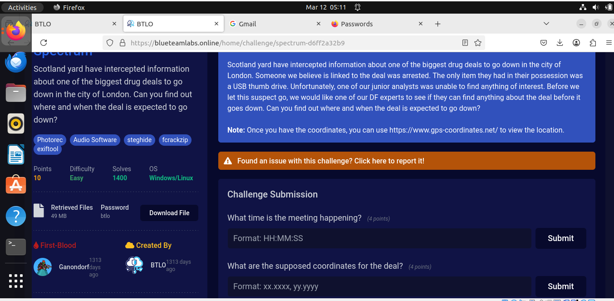

# Spectrum | Digital Forensics

### 

**Scenario**

Scotland yard have intercepted information about one of the biggest drug deals to go down in the city of London. Someone we believe is linked to the deal was arrested. The only item they had in their possession was a USB thumb drive. Unfortunately, one of our junior analysts was unable to find anything of interest. Before we let this suspect go, we would like one of our DF experts to see if they can find anything about the deal before it goes down. Can you find out where and when the deal is expected to go down?

Solution:

First,  i downloaded the file i will be working with for this project.

On my Terminal

After unizip the downloaded file , i discovered that it was a disk image.

i had  to verify the hash to be sure that i will be working with the right disc image

Next

I Launched and created a case using Autopsy 

selected the data source

Selected Disk Image as the Data source  Type

Data Source( I navigated to my Home Directory to  select the Disk Image.

The following ingest module were used

From the image we can se that the  the presence of FAT shows that it is a USB

Checking One of the Photos i discover that there is a text called steghide password+ cheese on toast. Steghide  is a tools used for steghanography ( a process of hiding data within a file such as pictures, audio e.t.c. This indeed is a clue that something is being hiden from the plain

I had to extract the files to the Downloads directory so i can use the command line to probe futher. using the terminal

from the file above, it has nothing to show that there is anything hidden

so i decided to unzip the  zip file i saw from my autopsy but it was requesting  for a password, in order to get the password i had to bruteforce the the zip file using fcrackzip

Cracked Password is  **garfied**

With the password, i was able the unzip the file and we have about 4 files.

Now, i had to continue trying the steghide passphrase the the files i just extracted 

Yeahhhhhhh!!!  the White.wav was the file  that was embed with a file called stardate.txt

The Content is Obfuscated, which makes it difficult to read.

i had to ask chat gpt what base this code is and then it suggested base 58, i had to to use cyberchef   to be able to decode the string.

However, i looked closely and discovered a  string “**emit”**  what does it mean?

when the number is a time, what a minute, what if we reverse it, **time which means 00:10:51 is the time of the Event.**

To look for the location.

i had to analyse the wav file, using the Sox tool .

viewing the image 

wow, we found a GPS Coordinate: which can  show us when they will be having their meeting.

i had to find the location using the website. [https://www.gps-coordinates.net/](https://www.gps-coordinates.net/)

Wolahhhhhh!!!! We found the location.  

From this Task, i have learnt the importance of thinking outside the box, things may not look as they seem but, you have to trust your instinct, make research and ask the right questions to be able to answer the right questions and leverage on tools
